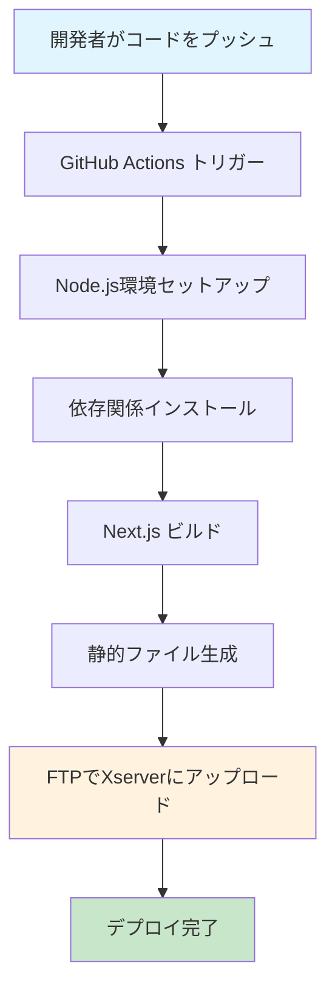
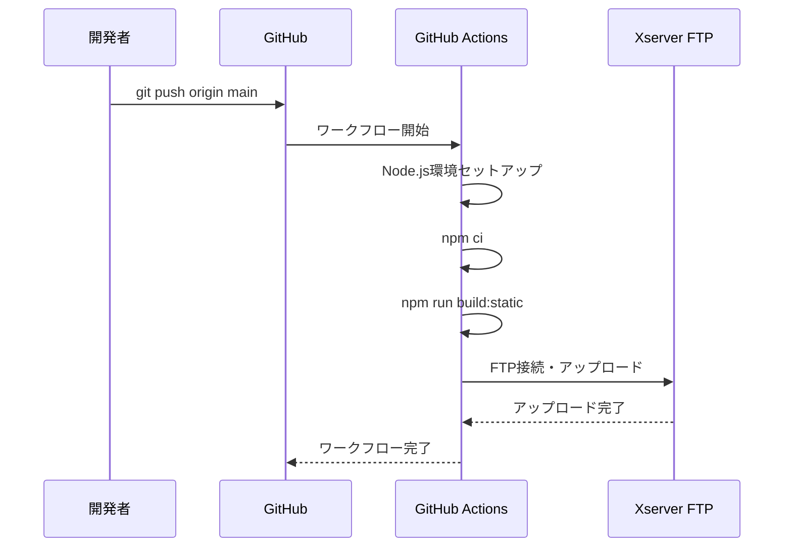
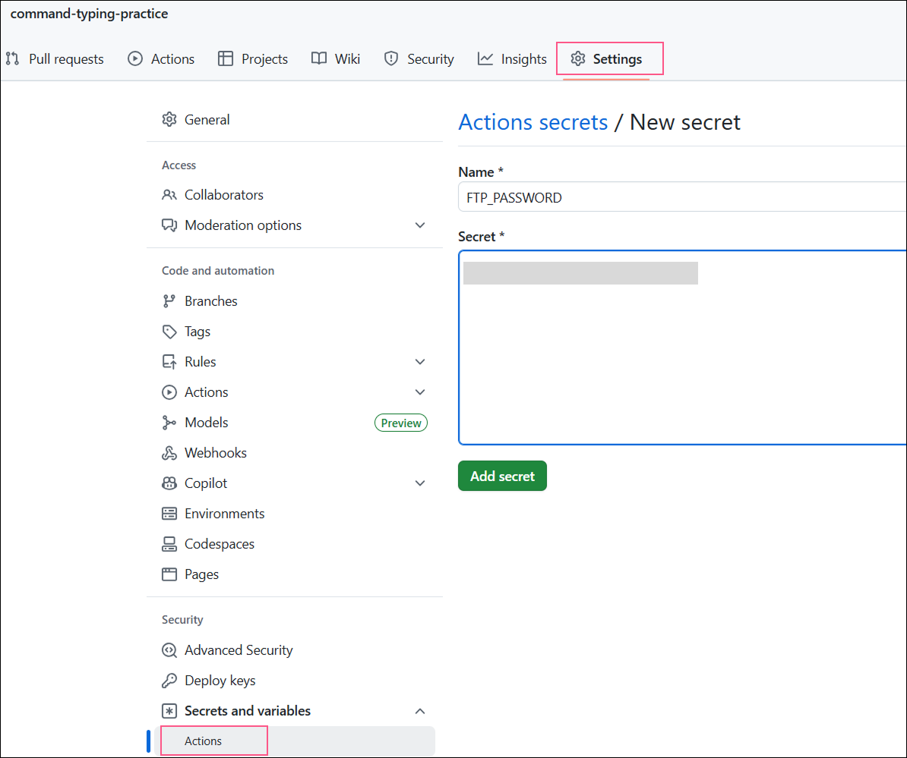
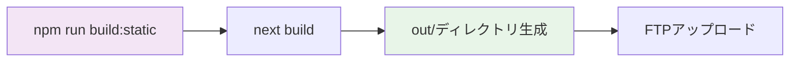

# GitHub Actions CI/CD セットアップ手順

## 概要
このプロジェクトは、GitHubにプッシュすると自動的にレンタルサーバー（Xserver）にFTPでデプロイされるCI/CDパイプラインを構築します。

## アーキテクチャ図



## デプロイフロー



## セットアップ手順

### ステップ1: XserverのFTP情報を確認

1. **Xserverのサーバーパネルにログイン**
2. **「FTPアカウント設定」を開く**
3. **該当ドメインのアカウント情報を取得**
   - ホスト名（例: `ftp.xserver.ne.jp`）
   - ユーザー名
   - パスワード
   - アップロード先パス（例: `/command-typing-practice/`）

### ステップ2: GitHub Secrets に登録

1. **GitHubリポジトリページに移動**
2. **Settings → Secrets and variables → Actions**
3. **「New repository secret」をクリック**
4. **以下のシークレットを登録**



| Name | Value | 説明 |
|------|-------|------|
| `FTP_HOST` | `ftp.xserver.ne.jp` | FTPホスト名 |
| `FTP_USERNAME` | `your_username` | FTPユーザー名 |
| `FTP_PASSWORD` | `your_password` | FTPパスワード |

### ⚙️ ステップ3: GitHub Actions ワークフロー追加

<a href="https://github.com/SamKirkland/FTP-Deploy-Action" action="blank">https://github.com/SamKirkland/FTP-Deploy-Action</a>
が公開してるActionを使ってます

1. **`.github/workflows/deploy.yml` ファイルを作成**
2. **以下の内容を追加**

```yaml
name: Deploy to Xserver

on:
  push:
    branches:
      - main  # または master

jobs:
  deploy:
    runs-on: ubuntu-latest

    steps:
      - name: Checkout code
        uses: SamKirkland/FTP-Deploy-Action@v4.3.4

      - name: Setup Node.js
        uses: actions/setup-node@v4
        with:
          node-version: '20'
          cache: 'npm'

      - name: Install dependencies
        run: npm ci

      - name: Build static site
        run: npm run build:static

      - name: Deploy via FTP
        uses: SamKirkland/FTP-Deploy-Action@v4
        with:
          server: ${{ secrets.FTP_HOST }}
          username: ${{ secrets.FTP_USERNAME }}
          password: ${{ secrets.FTP_PASSWORD }}
          local-dir: ./out
          server-dir: /command-typing-practice/
```

### ✅ ステップ4: 動作確認

1. **mainブランチにプッシュ**
   ```bash
   git add .
   git commit -m "Add CI/CD workflow"
   git push origin main
   ```

2. **GitHubのActionsタブで確認**
   - 「Deploy to Xserver」ワークフローが実行されているか確認
   - 緑色のチェックマークが表示されれば成功

3. **レンタルサーバーで確認**
   - `https://yourdomain.com/command-typing-practice/` にアクセス
   - 最新の変更が反映されているか確認

## 設定の詳細

### プロジェクト構成
- **Next.js 15.3.4** - Reactフレームワーク
- **TypeScript** - 型安全性
- **Tailwind CSS** - スタイリング
- **静的エクスポート** - `output: 'export'` でSSG

### ビルドプロセス


### 重要な設定ファイル

#### `next.config.ts`
```typescript
const nextConfig = {
  basePath: '/command-typing-practice',        // ベースパス
  assetPrefix: '/command-typing-practice/',    // アセットプレフィックス
  output: 'export',                            // 静的エクスポート
  trailingSlash: true,                         // 末尾スラッシュ
  images: { unoptimized: true },               // 画像最適化無効
};
```

#### `package.json` スクリプト
```json
{
  "scripts": {
    "build:static": "next build"  // 静的ビルド
  }
}
```

## トラブルシューティング

### よくある問題

| 問題 | 原因 | 解決方法 |
|------|------|----------|
| FTP接続エラー | 認証情報が間違っている | GitHub Secretsを再確認 |
| ビルドエラー | 依存関係の問題 | `npm ci`でクリーンインストール |
| ファイルが反映されない | キャッシュの問題 | ブラウザキャッシュをクリア |

### ログの確認方法
1. **GitHub Actions** → **ワークフロー実行** → **デプロイジョブ** → **ステップ詳細**
2. **エラーメッセージを確認**
3. **必要に応じてシークレットを更新**

## 次のステップ

### 最適化オプション
- **差分アップロード**: 変更されたファイルのみアップロード
- **SFTP移行**: より安全なプロトコルへの移行
- **キャッシュ戦略**: ビルド時間の短縮
- **通知設定**: Slack/Discordへのデプロイ通知

### セキュリティ強化
- **SSH鍵認証**: パスワード認証から鍵認証へ
- **環境変数分離**: 開発/本番環境の分離
- **アクセス制限**: 特定ブランチのみデプロイ

## 参考リンク
- [GitHub Actions 公式ドキュメント](https://docs.github.com/ja/actions)
- [FTP Deploy Action](https://github.com/SamKirkland/FTP-Deploy-Action)
- [Next.js 静的エクスポート](https://nextjs.org/docs/app/building-your-application/deploying/static-exports) 